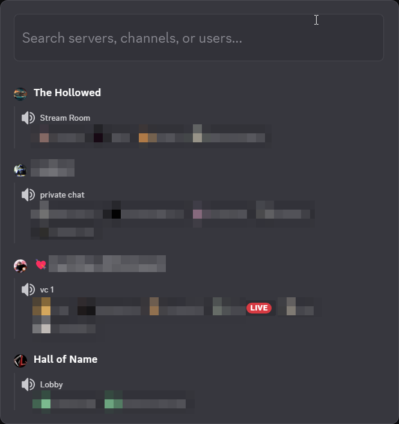
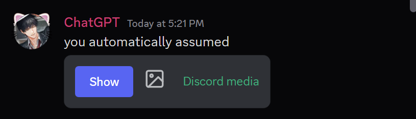
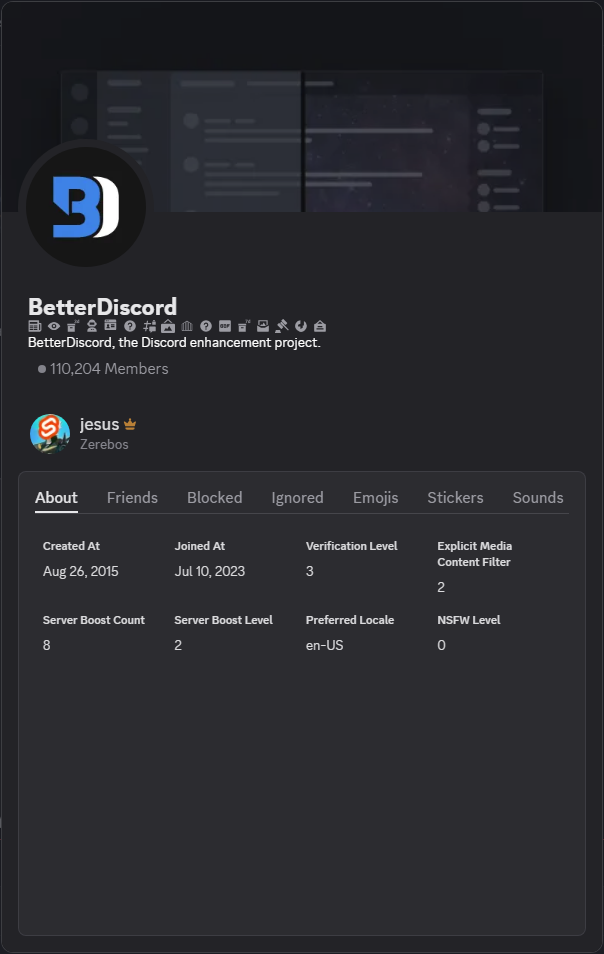
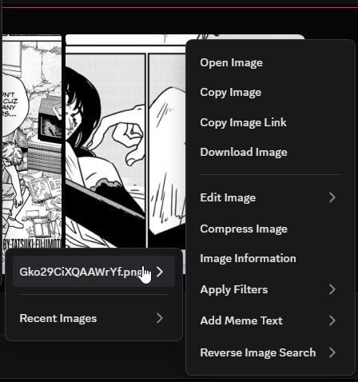
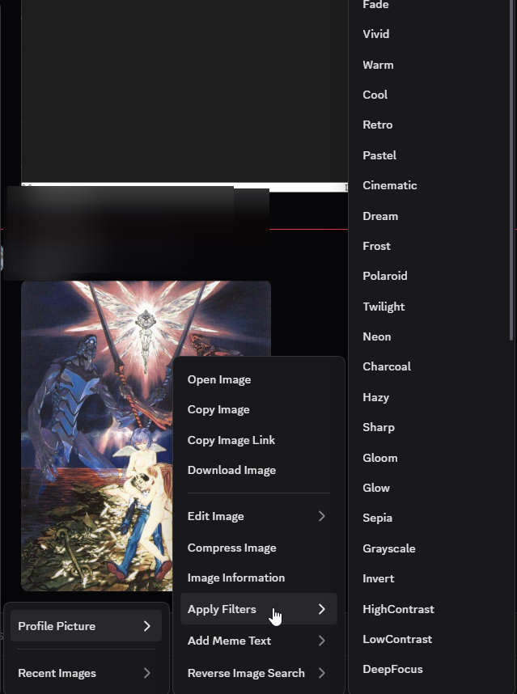
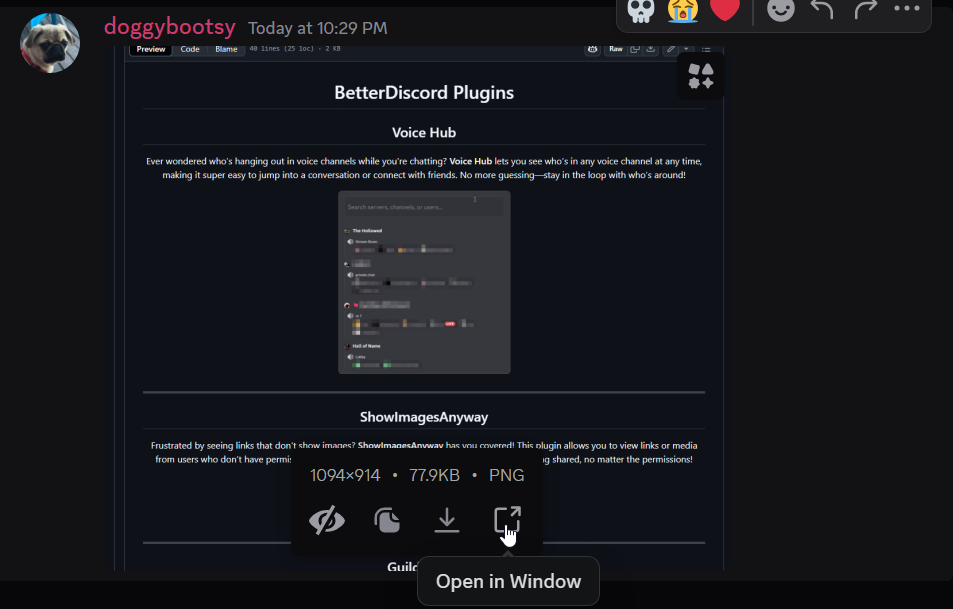

# BetterDiscord Plugins

## Voice Hub

Ever wondered who’s hanging out in voice channels while you're chatting? **Voice Hub** lets you see who’s in any voice channel at any time, making it super easy to jump into a conversation or connect with friends. No more guessing—stay in the loop with who’s around!

    

---

## ShowImagesAnyway

Frustrated by seeing links that don’t show images? **ShowImagesAnyway** has you covered! This plugin allows you to view links or media from users who don’t have permissions to embed them. Now, you can enjoy all the content being shared, no matter the permissions!

    

---

## GuildProfile

Want to know more about the servers you’re in? **GuildProfile** gives you access to extra information about your guilds, copying emojis, and stickers to other servers!

    

---

## BetterImageUtils

Take your image game to the next level with **BetterImageUtils**! This powerful plugin gives you control over images in Discord, including profile pictures, banners, and more. Enjoy features like meme text, external editing, recent images, reverse image search, and 40+ filtering options for images. Say goodbye to limitations and hello to creativity!

    
    
    

